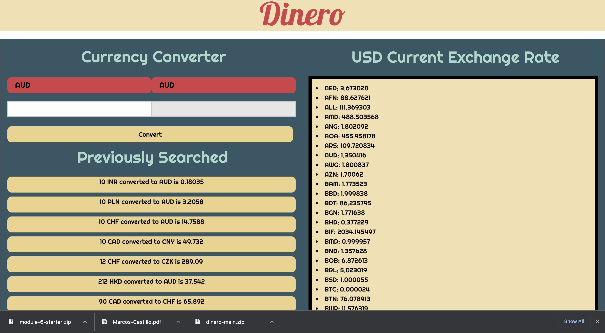

# CURRENCY EXCHANGE RATE PROJECT 1

## Purpose
The goal of this application is to provide the user with an easy exchange rate outlook. What does that mean? Anyone looking to further their financial gains will love this app for the following features:
* Clear and concise choices on what currency is being exchanged.
* Ease of mind, all necessary information on one screen. Current market climate and past performances for any currencies the user may care about.
* The user is able to log and save the projected exchange rate to compare currencies and choose what suits them most.

## Built with
* HTML
* CSS
* Foundation
* JavaScript

## Website
https://defhook.github.io/work-day/

## Contribution
Made by Alvin Badillo, Carl Bush and Marcos Castillo
🙉😺🐡
